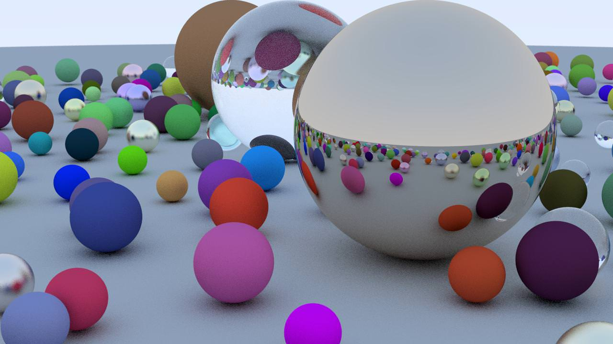

# Raytracer

The objective of this hackathon is to introduce you to the engineering of an advanced piece of software. In your career as Tech-Lead/CTO, you will be asked to conceive and engineer software that goes beyond a simple website or web-app with a database and API calls.

As a software engineer, you will be often asked to model a scientific principle, a mathematical principle, emulate physics-based behaviours. All this in the view of making a useful tool for your clients. This can often be a daunting task :

* you will need to learn, understand the mathematical, physical or otherwise technical concepts that are outside of your comfort zone
* you will need to translate these concepts into your domain : data-structures, algorithms, architecture, ....
* you will need to overcome performance problems
* you will need to provide a product that is actually _useful_ to your client

For this project, we are throwing you in the deep-end, and asking you to engineer a piece of complex mathematical software ! This is not because we are sadistic, there are in fact, a number of really important and useful skills that should come from this exercise :

* The ability to translate a mathematical principle to an engineering problem
* Choosing and implementing good data-structures, design patterns, and adopting a clean architecture
* Adding a programming language to your toolkit (if you do not already know C++)
* Be confronted by serious optimisation problems, and try and come up with solutions
* Pushing to create an agreeable user-experience

This is a group project, and therefore as a future Tech-Lead/CTO, you will also need to practice and refine your non-technical, but still essential skills :

* working and coordinating with other developers (planning, delegation, synchronisation, conflict resolution, ...). You are free to use whichever project management philosophy you desire (Agile, Scrum, Kanban, ...)
* working with a centralised GIT repository
* code-review between colleagues

## The project : a ray-tracer

The year is 2035. AI and Chat-GPT have destroyed the technical skills market. An entire generation of copy-paste developers has resulted in version of version of bad/buggy software. The giants of computer-based image rendering are brought to their knees. Adobe and Autodesk have gone under. Blender has become unusable.

The major 3D CGI film studios are desperate - they need their software to produce their next film, and have nowhere to turn! Fortunately, you are here to save the day!

Your mission is to create, from first principles, a **ray-tracer** : a piece of software that renders 3D images by simulating how light bounces around a scene.

<figure><figcaption>
Example scene rendered by a ray-tracer. <a href="https://github.com/mellinoe/veldrid-raytracer">Source</a>
</figcaption></figure>

You have one week to build this piece of software. The film studios require the following functionalities :

* Render at least a **sphere** and a **plane** with full reflection (that is, a totally metallic sphere that reflects its environment), and output a single image as a PNG image.
* You must be able to render a high resolution image of scene with a large quantity of objects, and at least 4 light-bounces. You must measure the render time and report it in your final submission. Remember, a film is composed of a series of static images. Your software will therefore have to render hundreds of thousands of images to create the film. The render-speed is therefore a big factor for the client!
* If this has been achieved, you will receive extra credit for any of the following :
  * The implementation of other surface shading models (Blinn, Phong, Gourad, Cook-Torrance)
  * Rendering other shapes, for example, cubes, cylinders, triangles
  * Rendering a 3D model (of the format .obj, .fbx, .collada or other)
  * Render optimisation strategies:
    * Space partitioning
    * Multi-threading or parallel processing
    * Using the GPU
    * Multi-processing (rendering on a cluster, task queues, etc.)
  * More advanced surface rendering techniques: texture-mapping, bump-mapping, environment mapping, ...
  * A structured scene modeling language (an input file ?) specifying the layout of the scene
  * Anti-aliasing
  * ...

However, in this dystopian future, there are some constraints ! All modern programming languages such as Go, Python, Java, etc have become full proprietary - to use them you need to pay huge royalties, that will make this project unfeasible. You have to use the only remaining free language : C++

Fortunately, there are some old sages that can impart some of the almost-lost knowledge about such fantastical software, that have been compiled in this guide. Read this information carefully !

* [My first C++](cpp/intro.md)

## Notation

You have been asked to **build a ray-tracer from first principles**, using the C++ programming language.


The purpose of this project is to develop your engineering skills, you ability to conceive and execute a complex software development. The following are therefore considered contrary to the spirit of the exercise, and will not be allowed or accepted :

* Copying or adapting, in any way or form, existing ray-tracer repositories that may exist on Git-Hub or elsewhere
* The use of Chat-GPT, or other artificial intelligence, to write your code

I will frequently ask you to explain your code, and you will be penalized if you cannot sufficiently explain your data-structure or algorithms.


**Delivery and deliverables**

You will need to present your software Thursday 31 October 2024. You will need to present the following :

* image(s) rendered by your software
* the total time taken to render your image(s)
* you will be asked to render an image live in front of the client
* you will be asked to present and explain some of your code
* you must provide a GitHub project link

**Notation**

Notation is performed _à la carte_. A basic functioning product (MVP) will earn you a passing note. After that, you are free to implement whichever technique you wish to improve your note, up to a maximum of 20 points.

The following notation grid will be used for evaluating the project :

| Aspect                                                    | Note            |
| --------------------------------------------------------- | --------------- |
| **Basic functioning product**                             |                 |
| A functioning C++ executable                              | 1               |
| A PNG image is produced                                   | 1               |
| At a minimum, flat shading of a sphere is accomplished    | 1               |
| At a minimum, diffuse shading of a sphere is accomplished |  2              |
| Rendering a plane                                         |  1              |
| Reflections                                               |  2              |
| **C++ architecture and code quality**                     |                 |
| Data structures                                           | 1               |
| Clean code                                                |  1              |
| Algorithms used and correctly explained                   | 1               |
| **Extra points**                                          |                 |
| Surface shaders other than diffuse                        | 3               |
| Rendering other shapes                                    | 3               |
| Rendering a 3D model (.obj, .fbx, ...)                    |  3              |
| Optimisation strategy                                     |  up to 8 points |
| Advanced surface rendering techniques                     |  3              |
| Structured language                                       |  2              |
| Any other feature sufficiently explained and implemented  |  3              |
