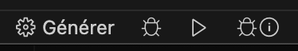

# C++

This is a short guide to help you start your first C++ project. 

You are free to use any software environment you wish, but this guide will help you with Visual Studio Code.

## VS Code Extension

Visual Studio Code has excellent support for C++, you can [follow this guide](https://code.visualstudio.com/docs/languages/cpp) to install the extension.

You will need to install a C++ compiler (if not already present) for your operating system :

- [gcc on windows](https://code.visualstudio.com/docs/cpp/config-mingw)
- [cmake on macos](https://code.visualstudio.com/docs/cpp/config-clang-mac)

In general, there are some excellent tutorials on getting started with C++ [at this website](https://code.visualstudio.com/docs/cpp/introvideos-cpp)


## A hello world program

The small example comes from the VSCode guides.

- [CMake for linux](https://code.visualstudio.com/docs/cpp/cmake-linux#_build-hello-world)
- [Cmake](https://code.visualstudio.com/docs/cpp/cmake-quickstart)

We just want to get a simple executable up and running that prints a message to the console. Create the file `helloworld.cpp` :

```cpp
#include <iostream>
#include <vector>
#include <string>

using namespace std;

int main()
{
    vector<string> msg {"Hello", "C++", "World", "from", "VS Code", "and the C++ extension!"};    

    for (const string& word : msg)
    {
        cout << word << " ";
    }
    cout << endl;
}

```

Your group may have have developers with multiple operating systems. We will try to make a compilation system that is cross platform, using CMake.

First install [CMake tools for VSCode](https://marketplace.visualstudio.com/items?itemName=ms-vscode.cmake-tools)

Once installed, open the VScode Command Palette (`cmd+maj+P` or `F1`), type `CMake` and choose `CMake: Quick Start`. Respond to the questions :

- enter a project name
- choose c++
- do not select CTest or CPack
- select "Executable" (not library)

This will create the `CMakeLists.txt` file that tells CMake how to build your project.

To use a modern version of C++, we must activate at least version 11 :


```txt
cmake_minimum_required(VERSION 3.5.0)
project(raytracer VERSION 0.1.0 LANGUAGES C CXX)

# add this line
set (CMAKE_CXX_STANDARD 11)

# change helloworld.cpp to the entry file of your project -the one that has "int main() {}"
add_executable(raytracer helloworld.cpp)
```


Run the command palette again (`F1`), type `CMake: Quick Start`, this will continue the process, asking how you wish to compile your project (create a `preset`). 

Select `Add a preselection`, then `Create from compilers`. A list of compilers available on your machine will be presented. Choose one. 

Then give a name to your preset, like `macos-clang`, or something that you can reuse.

You will see the file `CMakePresets.json` appear, containing your configuration.

Each team member may have to add his/her own present according to their architecture.

Once configured, you will see the bottom bar as options to build and run your app: 



Alternatively, you can navigate into the `build` directory, and type:

```bash
make
```

This will generate your executable in the same directory. I called mine `raytracer`, so I can run it using :


```bash
./raytracer
```


If you run your project, you should see the output in the terminal :

```
Hello C++ World from VS Code and the C++ extension! 
```


