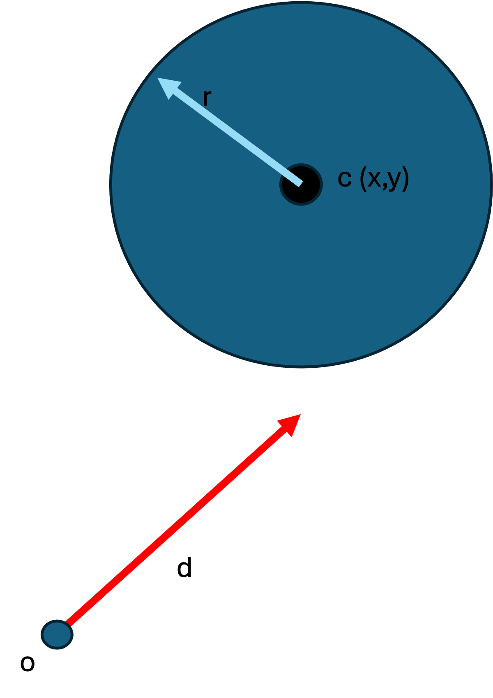
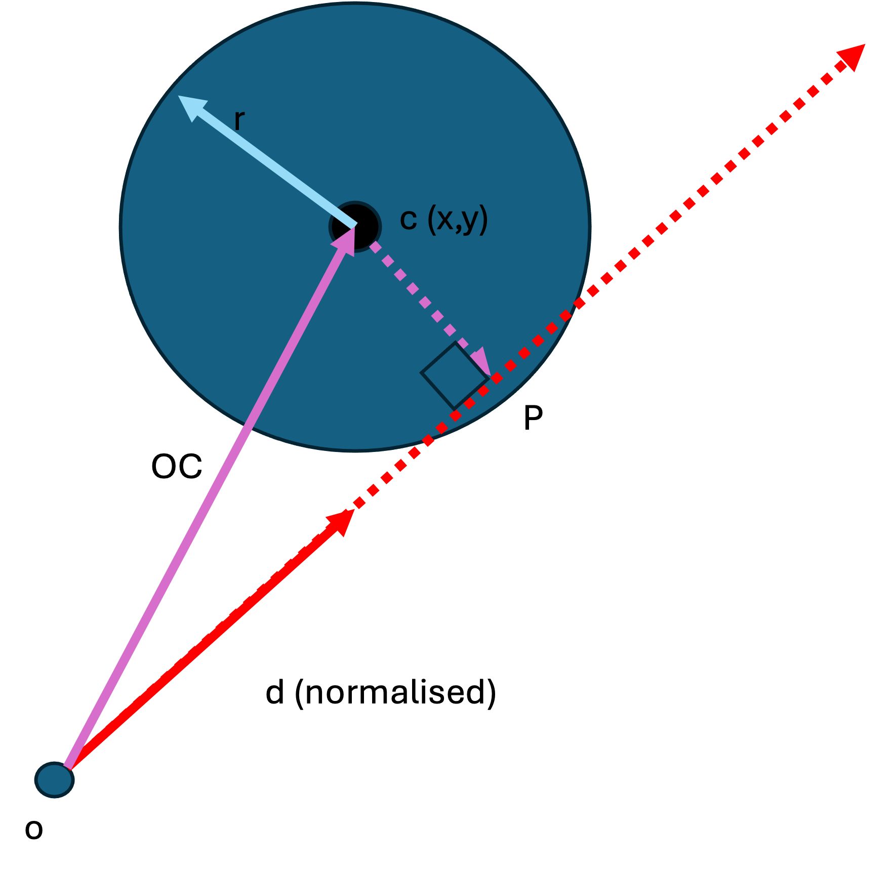
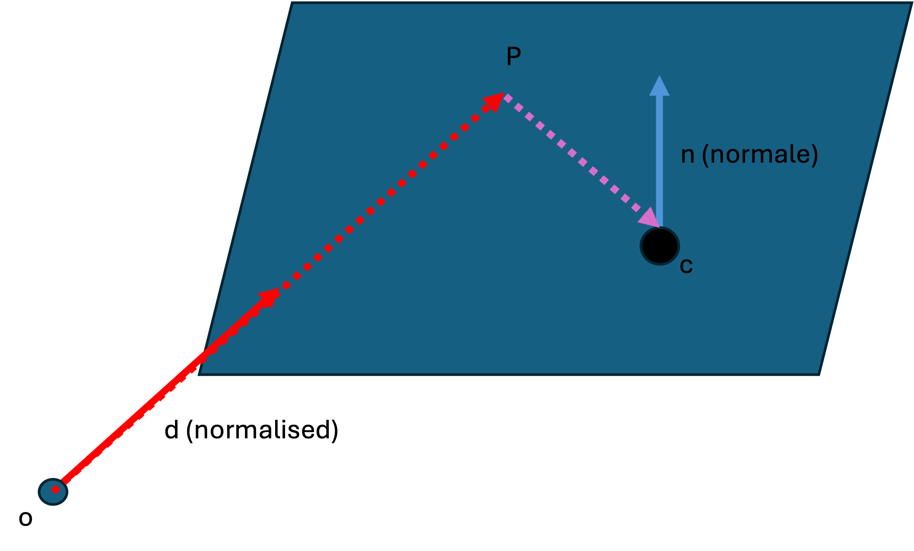

# Intersections

We now have a mathematical construct for representing a ray.

```
// Our ray
let o = (0, 0, 0)
let d = (?, ?, ?)
```

The purpose of our ray-tracer is to calculate if this ray intersects objects in our 3D virtual world!

How do we perform this calculation ?


## Intersection with a sphere

The surface of a sphere can be parametrically defined as a point in space (let us call it `c` for **center**) and a radius (`r`). The surface is the infinite number of points that are `r` units away from the center `c`.

Look at the following setup. We want to know if the red day will eventually intersect the sphere :




How can we do this ?

Well there are some things that we do know :

- We know the origin of our ray : `o`
- We know the center of the circle : `c`

Knowing these two positions, we can calculate a vector tha represents the distance to travel from `o` to `c` , using subtraction :

```
OC = c - o
```



If we **project** `OC` onto our ray, we get the point `P`. 

Fortunately, it is easy to project one vector onto another normalized vector, using the dot product. To project the vector `u` onto the normalized vector `v` we use the formula :


$$
proj(u,v) = (\bar{u}\cdot\bar{v})\bar{v}
$$

The dot product is easy to calculate :

```
let u = (u1, u2, u3)
let v = (v1, v2, v3)

let dotproduct = (u1 * v1) + (u2 * v2) + (u3 * v3)
```

So in our example the projection can be calculated :

```
let o = (ox, oy, oz)
let d = (dx, dy, dz)
let c = (cx, cy, cz)

OC = c - o = (cx - ox, cy - oy, cz - oz)

// Calculate the dot product which is just a float
dotProd = (OC.x * dx) + (OC.y * dy) + (OC.z * dz);

OP = dotProd * d = (dotProd * dx, dotProd * dy, dorProd * dz)

```

So, `OP` is the vector that takes us from `o` to `p`.

To calculate the actual value of P, we start at the origin of our ray, and add our vector ! 

```
p = o + OP
```

That's great, but how does knowing the position of `p` help us ? Well, if it lies within the sphere, we know that it definitely intersects it. How do we know if it is inside the sphere? Easy! If the distance between `c` and `p` is less than or equal to the radius of the sphere !


```
CP = p - c

// calculate the length of a vector using pythagorus !
let distance = length(CP) 

if (distance < r) { 
  // Intersects sphere!
} else {
  // No intersection
}
```

Great ! We know that there is an intersection ! How can be find the exact point of intersection `P1` ?


Well, as you can see, there is a right-angled triangle formed by `c`, `p` and `p1`, We already know the length of `CP`, we know the value of `r`, and so using pythagorus we can calculate the length of `P-P1` (let us call it `a`)

```
let lengthCP = length(CP);
let a = Math.sqrt( r*r - lengthCP*lengthCP )
```

To get the position `P1` we just need to move back by `a` units along our initial ray, but in the reverse direction:

```
let P1 = P + (a * (-d))
```

And there you have it !

Now that we know the exact location of P in the world we can start determining the color of the surface at that point !

Here is a pseudo-code summary of the calculations necessary to calculate the point of intersection :

```
struct Vector3 {
  x: float
  y: float
  z: float
}

// calculate the length of a vector
function length(a: Vector3) {
  float l = Math.sqrt(a.x*a.x + a.y*a.y + a.z*a.z);
  return l
}

// normalise a vector (divide by its length)
function normalize(a: Vector3) {
  float l = length(a);
  return (a.x / l, a.y / l, a.z / l)
}

// calculate the dot product between two vectore
function dotProduct(a: Vector3, b: Vector3) {
  return (a.x * b*x) + (a*y + b*y) + (a.z * b.z)
}

let ray = { o: Vector3, d: Vector3(normalized) }
let sphere = { c: Vector3, r: float }

function intersectSphere(ray, sphere) {
  
  let OC = sphere.c - o      // OC is a vector

  let dotProd = dotProduct(OC, ray.d)   // dotProd is a float

  let OP = dotProd * ray.d      // OP is a vector

  let P = ray.o + OP            // P is a point

  let CP = P - sphere.c                // CP is a vector

  let lenCP = length(CP)        // lenCP is a float

  if (lenCP > sphere.r) { return }    // No intersection

  let a = Math.sqrt(r*r - lenCP*lenCP)    // a is a float

  let P1 = P + (a * -ray.d)               // P1 is a vector

  return P1
}
```

## Intersection with a plane

An infinite plane can be expressed parametrically as follows : 

- suppose we have a point `c` in space, and a normal vector `n`
- the plane is all the points `P` where th vector `PC` is perpendicular to the normal `n` 



Fortunately the Dot Product is again our friend ! Because if the dot product between two normalized vectors is zero, it means that the two vectors that created it are perpendicular !

In the diagram, we suppose that P is also on our ray. If the ray direction is normalised, then we just need to find a multiplier `t`  for that ray that will resize it enough to get us to `p`

$$
\bar{p} = \bar{o} + t\bar{d}
$$


We don't know what `t` is yet.

We know that `P` is on the plane, and so our perpendicularity holds:

$$
(\bar{p} - \bar{c})\cdot(\bar{n}) = 0
$$


Let us substitute `p` from our ray into the formula for the plane :

$$
(\bar{o} + t\bar{d} - \bar{c})\cdot\bar{n} = 0
$$

Multiply out the dot product :
$$
\bar{o}\cdot\bar{n} + t\bar{d}\cdot\bar{n} - \bar{c}\cdot\bar{n} = 0
$$

Solve for `t`

$$
t\bar{d}\cdot\bar{n} = \bar{c}\cdot\bar{n} -\bar{o}\cdot\bar{n}
$$

$$
t\bar{d}\cdot\bar{n} = (\bar{c} -\bar{o})\cdot\bar{n}
$$

$$
t = \frac{(\bar{c} -\bar{o})\cdot\bar{n}}{\bar{d}\cdot\bar{n}}
$$


First, let us calculate the denominator :

```
let denom = dotProduct(ray.d, plane.n)

if (denom < 0.000001) {
  // The ray is parallel to the plane
  return
}
```

If the denominator is zero or close to zero, this means that our ray is perpendicular to the normal, which means that the ray is parallel to the plane and will never intersect it!

Next, let us calculate the numerator :

```
let num = dotProduct(plane.c - ray.o, plane.n)

let t = num / denom
```

Now that we have `t`  we can calculate the point `p` by substituting it into the formula for our ray :


```
let p = ray.o + t * ray.d
```

All together :

```

let ray = { o: Vector3, d: Vector3(normalized) }
let plane = { c: Vector3, n: Vector3(normalized) }

function intersectPLane(ray, plane) {
  
  let denom = dotProduct(ray.d, plane.n)

  if (denom < 0.000001) {
    // The ray is parallel to the plane
    return
  }
  let num = dotProduct(plane.c - ray.o, plane.n)

  let t = num / denom

  let p = ray.o + t * ray.d

  return p

}
```
