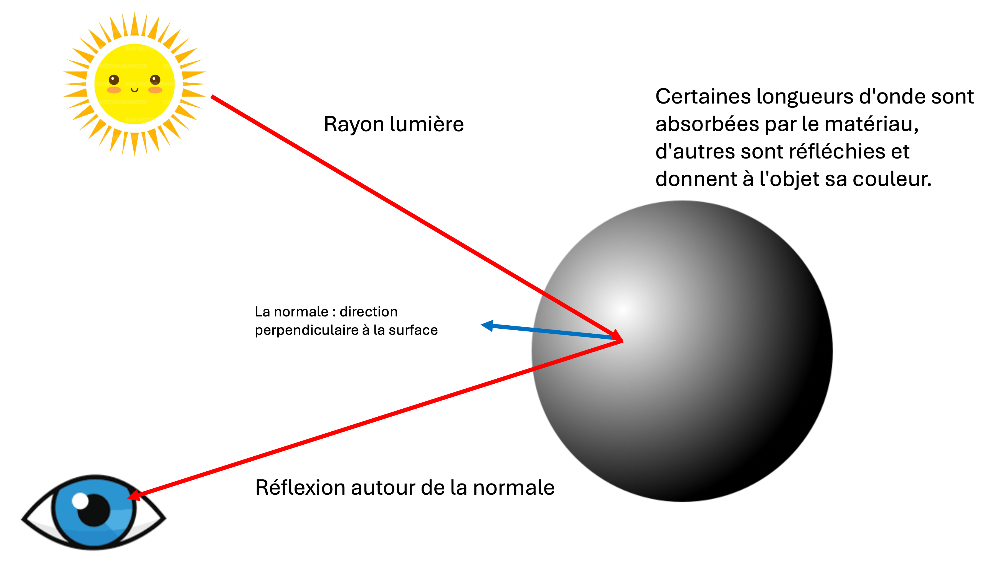
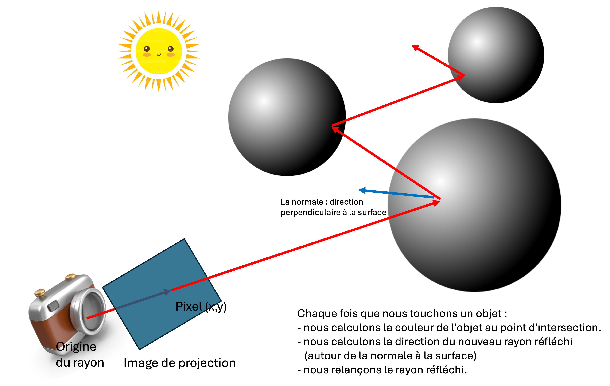
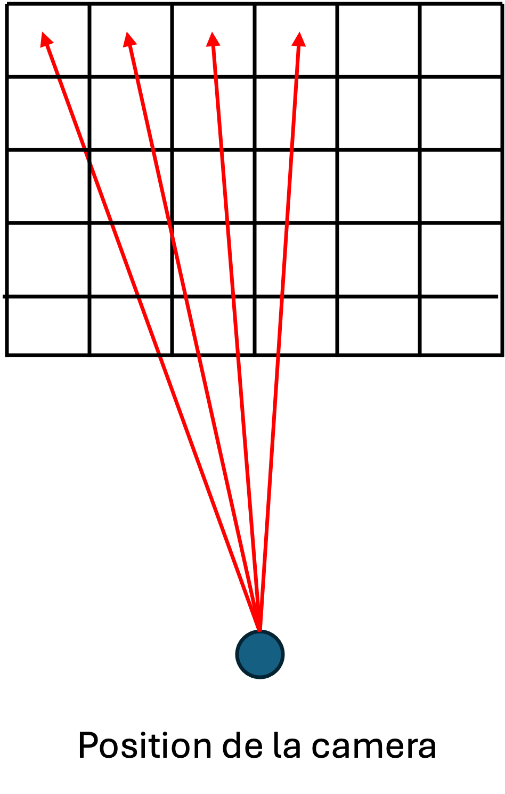

# What is a raytracer ?

In photo-realistic rendering, a *ray-tracer* aims to simulate how light bounces around a virtual three dimensional scene.

The goal is to render an image that is as close to a real world appearance as possible - hence the word "photo-realistic".

We are simulating light - a physical phenomenon that involves frequencies, wavelengths, material properties and so on. You will discover that trying to simulate any natural world phenomenon on a computer is a difficult and often computationally costly exercise (making it a great learning experience for this course!).

When we *model* real-life physics, to reduce the problem to a manageable one, we create a simplified version to start with. Lets do that for light rays !

## A simplified light model

Let us simplify how we actually perceive things in the real world, as illustrated in the following image :



At its simplest, a light (or the sun) emits light rays, which can be represented by a **directional vector**, a straight line that has a source, and a direction.

This light travels in a straight line, until it hits an object in our world. Some of the light's wavelengths (colors) will be absorbed by the surface of the object, depending on what it is made of. Some surfaces, like wood, absorb all colors except brownish ones. A white piece of paper absorbs almost none of the colors, and reflects all of them. 

The light ray is reflected around the **surface normal** at the point where it intersects the object. A surface normal is the direction **perpendicular** to the surface. This reflected ray of light continues on its journey in the world.

Perhaps the light ray enters our eye, and lands on our retina. This is how we perceived things on our world ! Based on light that has bounced around the world, colors being absorbed or reflected along the way, and by luck, entering into our eyes.

## An inverse model for simplicity

It would be way too expensive to simulate every single light ray emitted by a light source in a virtual scene, hoping to record only those that happen to land on our virtual retina ! We need to simplify the problem. 

What if we reversed the problem ? Let us ignore all the light the never enters into our eye, and rather simulate only those that do. We drastically reduce the number of rays to calculate.

But how do we know which ones starting at the light source eventually end up in our eyes ?

Well, the rays are just a series of straight lines bouncing around their normals. What works in one direction also works just as well in the other direction !

Let us start the ray this time in our eye, and shoot it out into the scene. When we hit an object, we can determine the color of that object (at the point of intersection), calculate the new reflected ray, and repeat the process.

The final color that our virtual eye sees will be just the accumulated colors (that is, adding the colors) by the path traversed by our ray !



## What is a color ?

In physics, a color is a light with certain wavelength. This is a little complicated, and we can model this entity more simply.

Our modern computer screens give us the impression of seeing images photos and movies by emitting light at various wavelengths. If you look very closely at a computer screen you will notice that it is a tightly packed array of LED emitters of the three base wavelengths: red, blue and green (RGB). Using these three wavelengths we can produce a **gamut** of color ranging from near black (absence of light) to white (full intensity).

Each triplet of red, green and blue LEDs represents a single **pixel**. If we arrange a row of 1920 tightly packed pixels horizontally, and do this for 1080 rows, we will have an HD screen with 1920x1080 pixels, or 1920x1080x3 LEDS !

RGB has becoming the standard unit for representing color in light-emitting devices, and we will be using that here. 

So what is a color in our context ? It is the intensity of red, green and blue for a single pixel! It is easy to represent using a three dimensional tuple:

`(red, green, blue)`

We are free to decide in what range to represent each intensity (or **color depth**). For example, if we use 1 byte (therefore, a minimum of zero and a maximum value of 255) to represent each intensity, we could have the following :

```
Red:   (255, 0, 0)
Green: (0, 255, 0)
Blue:  (0, 0, 255)
```

Alternatively we could normalise this value, and say that we will represent each component as a floating point between 0 and 1 :

```
Red:   (1, 0, 0)
Green: (0, 1 0)
Blue:  (0, 0, 1)
```

The advantage of this representation is that we can easily accumulate colors by simple addition !

What do you get when you mix red and green (in light, not paint!) ? Yellow !

```
(1, 0, 0) + (0, 1, 0) = (1, 1, 0)
```

This is simple vector addition, where we add each component from the first vector to the corresponding component of the second vector.

There is one catch though. We can never have a value greater than the maximum. So if we added turquoise to our yellow, we would simply get white (and not some otherworldly color like octarine) :

```
(1, 1, 0) + (0, 1, 1) = (1, 1, 1)   // and not (1, 2, 1)
```

## What is an image ?

Our goal is to render an **image**, a two dimensional plane onto which light from the world is projected.

We know that our image is made up of **pixels** (for example, 1920x1808 pixels in total).

An image is thus just a huge array of color tuples.

```
[
  (0, 0, 1),
  (0, 0, 1),
  (1, 0, 1),
  (1, 1, 1),
]
```

The above example is a 2x2 image containing 4 pixels.

The goal of our raytracer is thus to calculate the correct color for each pixel, so that it accurately represents a projection of the scene !

Once we have this array of RGB values, it is just a matter of saving it to a file (a bitmap, without compression, or a .png for lossless compression)


## An algorithm for generating our image

The following pseudo-code could be used to generate an image :


```ts

let width = 1920
let height = 1080
let pixels = Array(1920x1080)

// The position of the camera in the world
const cameraPosition = (0, 0, -1)
// The direction of the camera
const cameraDirection = (0, 0, 1)

for (let y = 0; y < height; ++y) {
  for (let x = 0; x < width; ++x) {
    
    // Initially the color of the pixel is black
    let color = (0, 0, 0);

    // Get the world ray starting at the camera position, and going through the current pixel
    let direction = getWorldRay(x, y);

    // Cast the ray into the world
    color = color + castRay(cameraPosition, direction)

    // Set the pixel in the image
    pixels[(y * width) + x] = color;
  }
}

```

How do we get the **world ray** ?

Actually it is quite easy, we just want to shoot a ray from our eye through each pixel of a virtual image in front of our eye :




Easy right ? Well... you may need a bit of math to actually implement this algorithm.


