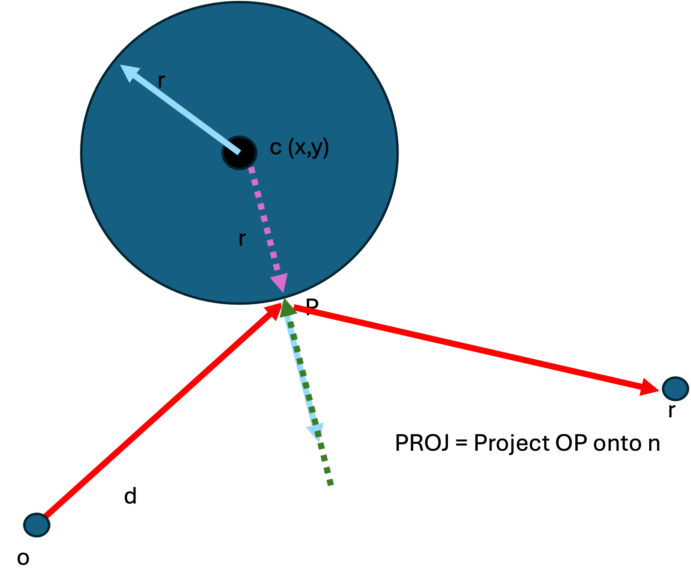
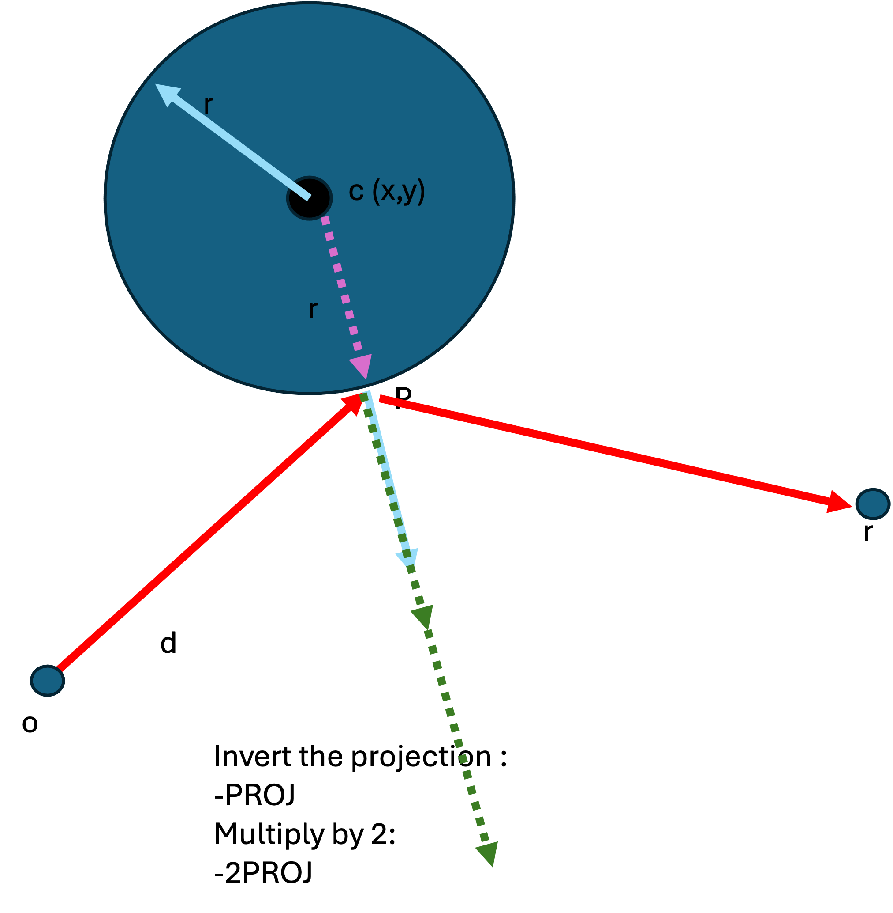
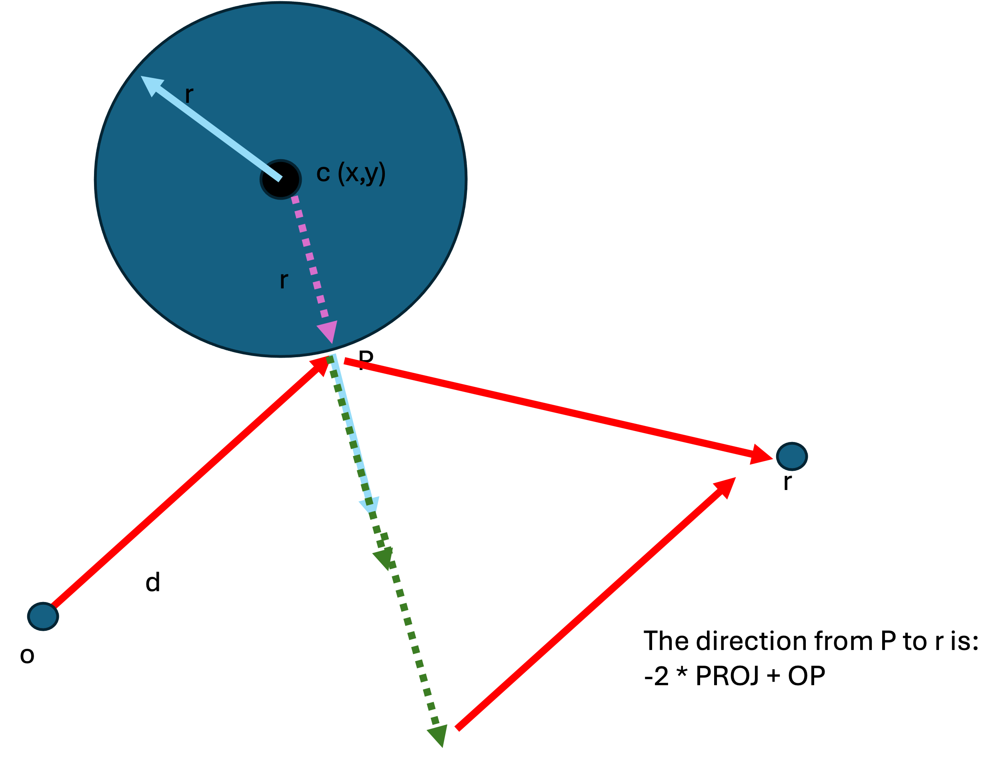

# Reflections

One we have calculated the color at a point, we may want to accumulate reflections from other objects at this point.

This means casting a ray in a direction around the normal.


```
pixel = pixel + castRay(P, reflectDirection)
```

We repeat the process of raycasting and add the returned color to the current color. In reality, we would apply a multiplier to attenuate the reflection color:

```
pixel = pixel + sphere.reflectFactor * castRay(P, reflectDirection)
```

But how do we calculate the reflection direction ?

Consider the image:


We need to calculat the vector `PR` which is a reflection of `OP` around the normal `n`.

How can we do this ?

First let us project `PR` onto the normal: 




Now let us invert this projection (multiply by -1), and double it :



Now if we add our original direction vector to our projection we arrive at `r` !



In code, our reflection vector is calculated as follows :


```
let normal = normlize(P - sphere.c);

function reflectRay(ray, normal, P) {
  // project the ray direction onto the normal
  let proj = dotProduct(ray.d, normal) * normal

  // invert the projection and multiply by 2
  proj = -2 * proj

  let reflectDir = proj + ray.d  

  // The new ray has P as its starting point, and the reflectDir as its direction
  return new Ray(
    o = P
    d = reflectDir
  )
}

```