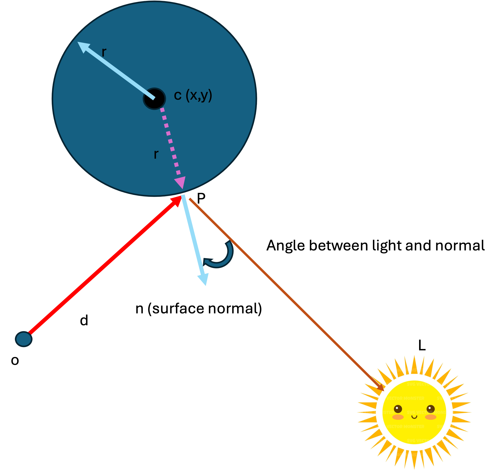

# Shading


Remember we are trying to calculate the color of a pixel.

Let us suppose our pixel starts at black:


```
let pixel = (0, 0, 0)
```

If we cast a ray and it hits nothing in the scene, well the pixel stays black and we continue to the next pixel.

However, if we hit an object, we can set the pixel to the **ambient color** of that object.

Suppose we intersect a sphere, and we know that sphere is a dark shade of green :


```

let pixel = (0, 0, 0)
let ray = { o: Vector3, d: Vector3(normalized) }
let sphere = { c: Vector3, r: float, ambientColor: Color }

let P = intersectSphere(ray, sphere)

if (!P) { return }   // no intersection 

// Add the base color of the sphere
pixel = pixel + sphere.ambientColor

```

Implement this algorithm in your code, you will have implemented a **flat shader** !

## Diffuse shading

It is light in our scene that gives our objects their depth. We need to take into account the light and the form at the surface of our intersection point.



In the above image, we have already calculated that our ray intersects the sphere at point P. Now we want to know the color of the sphere at P.

A simple shading model is to say the color of the point is relative to the angle between the incoming light and the normal at the point.

The smaller the angle, the more directly the light hits the surface. The larger the angle, the less directly the light hits the surface.

Looking at the diagram we can calculate the normal of a sphere, which is just the vector `CP`

```
let CP = P - sphere.c
```

The vector pointing to the light is just the position of the light subtracting the point:

```
let PL = L - P
```

Once again, the dot product comes to our rescue. Remember we said that if the dot product between two vectors is zero, then they are perpendicular ? Well it follows that if the dot product is 1, then the two vectors are parallel.

We can thus use the dot product as a multiplier of intensity ! If the angle to the light is perpendicular, the dot-product value is 0, and so we multiply the color of our object by zero (black). If the angle to the light is 0 degrees, the dot-product value is 1, and we multiple the color of our object by 1. 

```
let nCP = normalize(CP);
let nPL = normalize(PL);

let intensity = dotProduct(nCP, nPL);

pixel = pixel + intensity * sphere.ambientColor

```

## Shading models

There are of course, many shading models that exist. Try implementing your own !

- [Phone](https://en.wikipedia.org/wiki/Phong_reflection_model)
- [Blinn-Phong](https://en.wikipedia.org/wiki/Blinn–Phong_reflection_model)
- [Cook Torrance](https://garykeen27.wixsite.com/portfolio/cook-torrance-shading)

