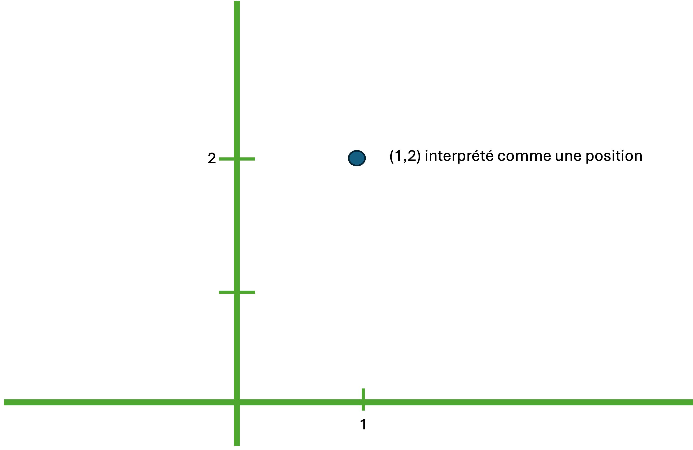
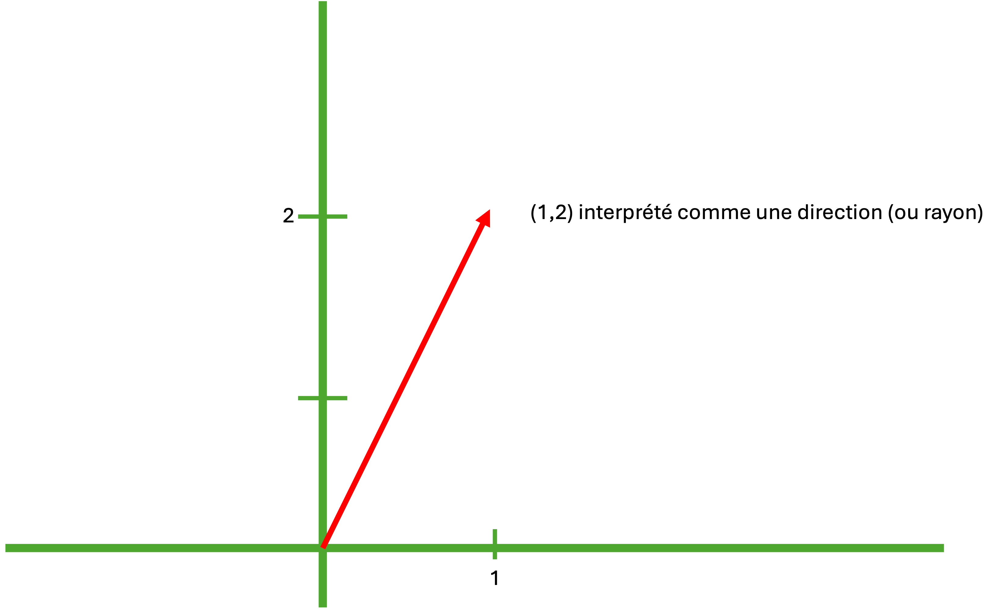
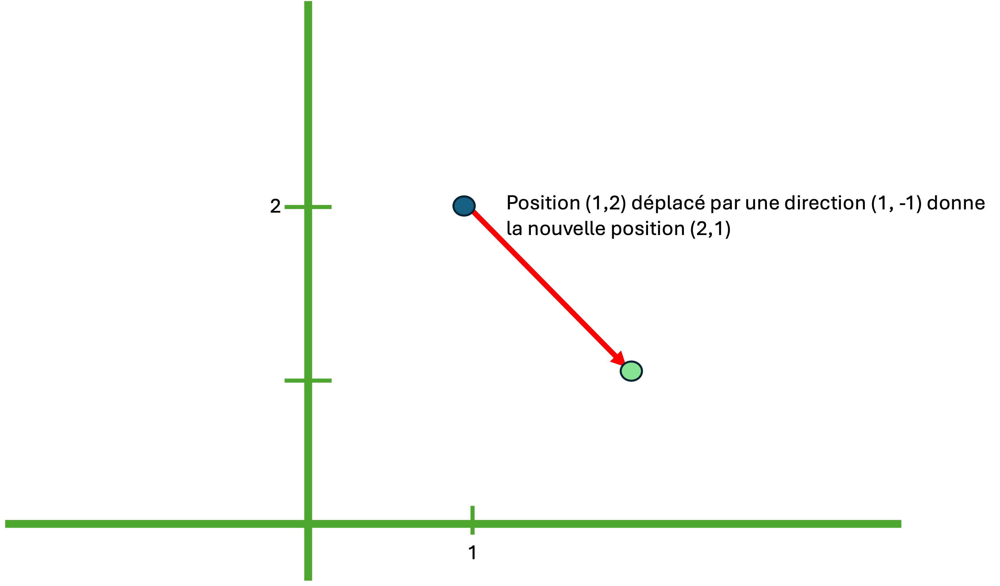
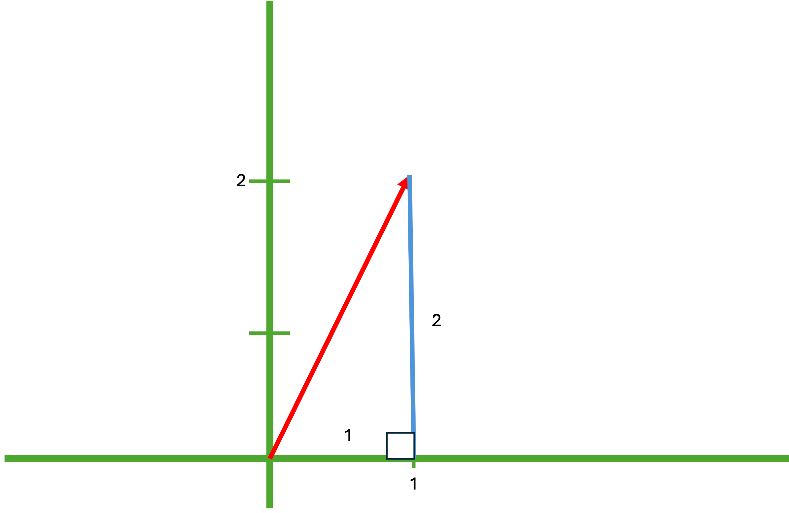
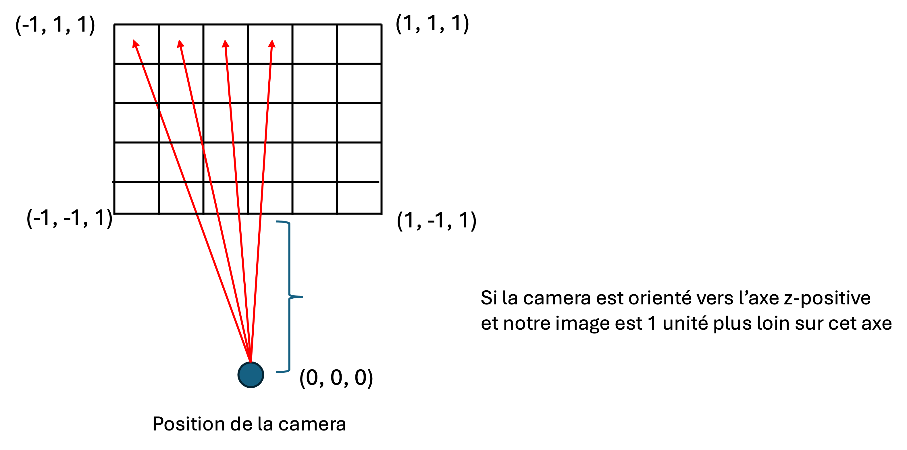

# Vector math

We need a way of representing rays and positions in our 3D world.

## Positions

We know that a position in two dimensions can be represented using the horizontal position (`x`) and the vertical position (`y`) in a simple vector form :


```
(x, y)
```

So a point 2 units to the right, and 1 unit up would be :

```
(2, 1)
```

We can just add a dimension, or a third value to our vector to represent depth :

```
(x, y, z)
```

If the point above is actually 3 meters away (3 units down the z-axis) :

```
(2, 1, 3)
```


## Directions

A direction can also be represented using a 3D vector. Imagine we are standing at the origin, looking directly down the positive x-axis. This direction can be represented as follows :

```
(1, 0, 0)
```

Or if the person is looking at the positive z-axis:

```
(0, 0, 1)
```

You may be a bit confused. What is the difference between a position and and direction ? 

Well it all depends on how we interpret our vector.

Consider the vector `(1, 2)`. We could interpret it as a point in 3D space (a position) :



We would also say that this same vector represents a direction that starts at `(0, 0)`:



They have exactly the same form, but very different meanings !

## Addition

Vector addition is really cool because a simple `+` between a point and a direction gives us a new point :

```
Point (1, 2) + Direction (1, -1) = New Point (2, 1)
```



Or more simply put:

```
(1, 2) + (1, -1) = (2, 1)
```

## A ray

So what is a ray ?

A ray is composed of 2 parts :

- `o` : an origin (a position)
- `d` : a direction (usually **normalised**, that is, with a length of one)


```
ray = o + d
```

If our camera is positioned at the origin `(0, 0, 0)` and we shoot a ray through the point `(-1, 1, 1)` our ray would look as follows :

```
ray = (0, 0, 0) + (-1, 1, 1)
```

## Normalising a directional vector

Our vector math will be easier if the direction part of our ray has a length of 1. How do we force the directional vector to 1 ? Well, we divide by its length !

For example, if a vector has a length of 5, we know that `5 / 5 = 1`. So we just need to divide each component of our direction vector by 5.

But how do we get the length of a vector ? Pythagorus !



Any direction vector can be expressed as a right-angled triangle relative to the world axes. The length of this triangle is therefore :

$$
h^2 = x^2 + y^2
$$

Or:
$$
h = \sqrt{x^2 + y^2}
$$

We can thus normalise the vector by just dividing by `h`:

```
d = (1, 2, 3)
length = Math.sqrt(1*1 + 2*2 + 3*3)
dNorm = (1 / length, 2 / length, 3 / length)

```


## Ray tracing

Let's come back to our ray tracer. To simplify our calculation, let us position the camera at the origin `(0, 0, 0)`. 

Let us say we want to project the scene onto a square plane 1 unit down the z-axis from the camera :



We therefore will cast a ray through each pixel :

```
ray00 = (0, 0, 0) + (-1, 1, 1)
ray01 = (0, 0, 0) + (-0.666, 1, 1)
ray02 = (0, 0, 0) + (-0.333, 1, 1)
...
ray10 = (0, 0, 0) + (-1, 0.666, 1)
ray11 = (0, 0, 0) + (-1, 0.333, 1)
...
```



What if the camera is not at the origin ? What if the camera is not facing the positive z-axis ? 

Can you figure out the math to still cast the series of rays ?
